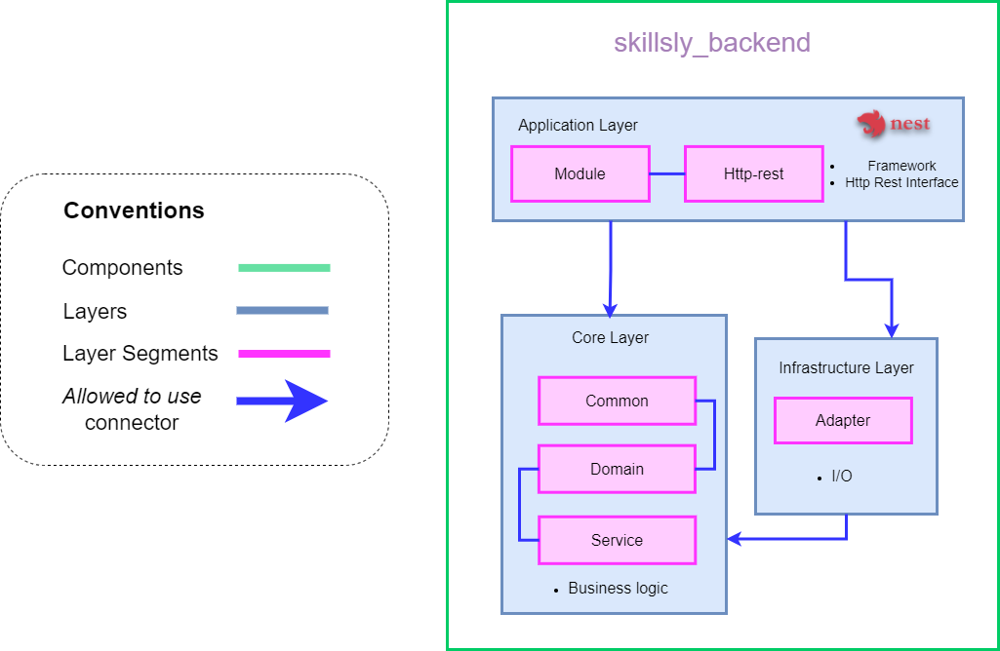

# Skillsly Backend

Application Logic component that exposes a REST API. This component uses socket.io for real-time
communication with client components, and also uses a Neo4J database for persistence.

The layer structure of this component is the following:

**Application**  

- ***Module*** **segment**: Defines NestJS modules, dependency injection and configurations
  for libraries.
- ***HTTP-Rest*** **segment**: Defines NestJS REST controllers, authentication, authorization and
  exception handlers.

**Core**  

- ***Common*** **segment**:  This segment contains abstractions required by the other segments
that are part of the core layer, such as interactor interfaces, persistence interfaces,
core exceptions, abstract classes and diverse utilities.  
- ***Domain*** **segment**:  context-specific or domain-specific elements are defined here, such
as use cases (interactors) abstractions, business entities with their business logic, DTOs
that cross boundaries, persistence interfaces for each interactor (gateways) and query models
that define which data is necessary for queries regarding the feature.  
- ***Service*** **segment**:  context-specific classes that define application logic (features).  

**Infrastructure**  

- ***Adapter*** **segment**: Defines adapter elements for persistence, network communication
and other infrastructure elements, such as payment methods. Also defines models and
implementations of different vendors (Neo4J for persistence, Stripe for payments).  
- ***Config*** **segment**: Includes different setups for infrastructure components, such as
the web server and database.  

**Test**
- ***bdd-functional*** **segment**: Includes feature files for functional BDD testing and their
implementations, all of them separated by contexts.  

